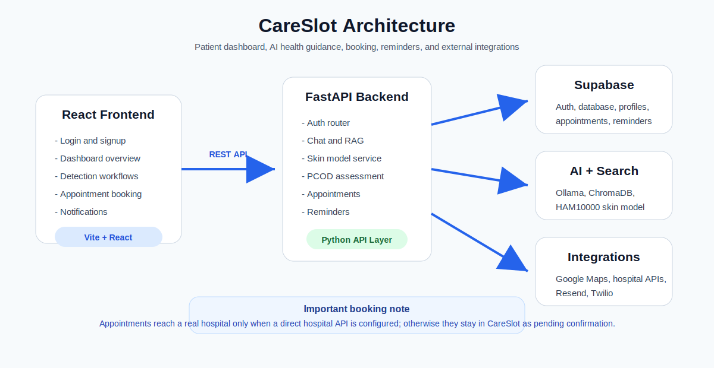
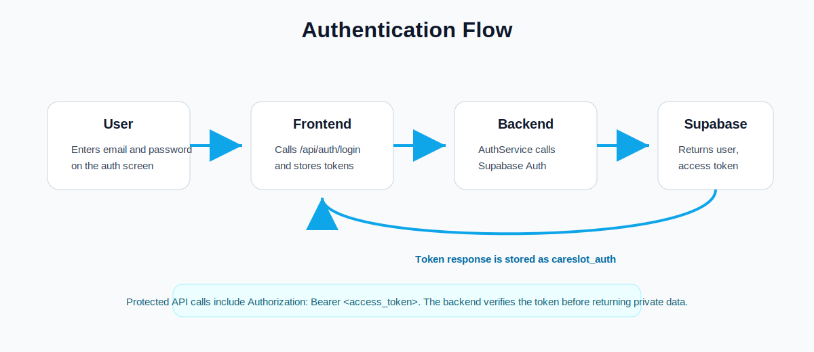
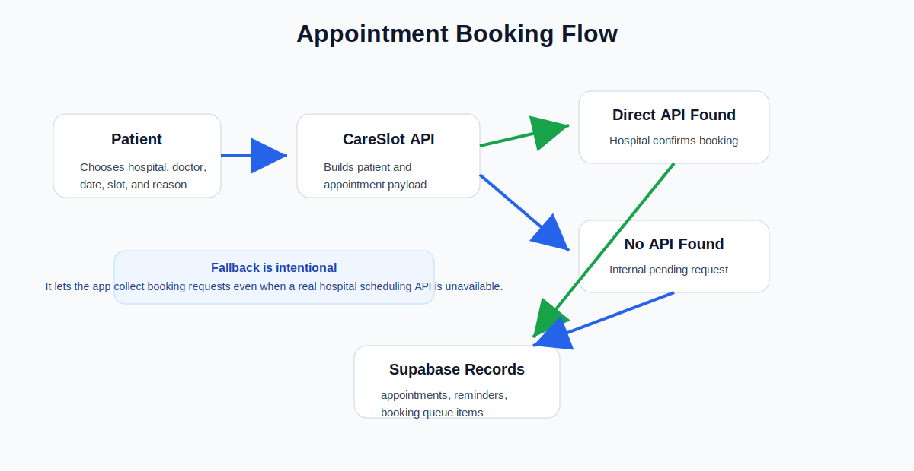

# CareSlot

CareSlot is an AI-assisted healthcare web app for patient onboarding, symptom support, skin disease screening, PCOD/PCOS risk assessment, hospital discovery, appointment booking, and reminder delivery.

It is built as a React frontend with a FastAPI backend, Supabase for auth/database, local AI services for health guidance, and optional external integrations for Google Maps, hospital scheduling APIs, Resend email, and Twilio SMS.

> CareSlot provides preliminary health guidance only. It is not a diagnosis platform and does not replace a doctor.

## Visual Overview

<p align="center">
  
</p>

### System Architecture



The frontend talks to the FastAPI backend through REST endpoints. The backend handles authentication, AI workflows, appointment booking, notifications, and all server-side secrets. Supabase stores users, profiles, appointments, reminders, predictions, and booking queue records.

## Main Features

| Area | What it does |
| --- | --- |
| Authentication | Email/password signup, login, token refresh, protected dashboard routes |
| Dashboard | Overview of appointments, detection options, patient activity, and quick actions |
| AI Chat | Symptom-oriented health guidance using Ollama/LangChain and local knowledge |
| Skin Detection | Image upload and HAM10000/MobileNetV2-based skin condition prediction |
| PCOD/PCOS Assessment | Risk questionnaire and specialist recommendation flow |
| Hospital Search | Google Maps-based hospital/clinic discovery with specialty matching |
| Appointment Booking | Direct hospital API booking when configured, otherwise internal pending-confirmation flow |
| Reminders | In-app reminders plus optional email/SMS delivery |
| Notifications | Stored user notifications and scheduled reminder processing |

## Product Screens

These images are local project assets used by the frontend experience.

| Health Tech Experience | Care Journey |
| --- | --- |
|  |  |
|  |  |

## How Authentication Works



1. The user submits email and password on the React auth page.
2. The frontend calls `POST /api/auth/login` or `POST /api/auth/signup`.
3. `AuthService` uses Supabase Auth to validate credentials.
4. The backend returns an access token, refresh token, user id, and email.
5. The frontend stores the auth payload as `careslot_auth`.
6. Protected API calls send `Authorization: Bearer <access_token>`.
7. Backend middleware verifies the Supabase JWT before returning private data.

Relevant files:

- `frontend/src/context/AuthContext.jsx`
- `frontend/src/services/api.js`
- `Backend/app/services/auth_service.py`
- `Backend/app/middleware/auth.py`
- `Backend/app/services/supabase_service.py`

## How Appointment Booking Works



CareSlot has two booking modes.

### 1. Direct hospital API mode

If a selected hospital has a real integration entry in `HOSPITAL_API_REGISTRY_JSON`, CareSlot sends the booking request to that hospital API.

The appointment is stored with:

```text
booking_mode = direct_api
status = confirmed
```

This is the only mode where the appointment actually reaches the hospital's scheduling system.

### 2. Internal fallback mode

If no hospital API is configured, CareSlot still saves the appointment request internally.

The appointment is stored with:

```text
booking_mode = fallback_internal
status = pending_confirmation
booking_confirmation_status = pending_hospital_confirmation
```

It may also create a row in `hospital_booking_requests` so staff/admin workflows can review and confirm it later.

Important: with the default config below, bookings are internal only:

```env
HOSPITAL_API_REGISTRY_JSON={}
```

Relevant files:

- `Backend/app/services/appointment_service.py`
- `Backend/app/services/hospital_integration_service.py`
- `Backend/app/routers/appointments.py`
- `Backend/scripts/appointment_booking_migration.sql`

## Tech Stack

### Frontend

- React 19
- Vite
- React Router
- Tailwind CSS
- Framer Motion
- Lucide React icons

### Backend

- FastAPI
- Pydantic Settings
- Supabase Python client
- LangChain
- ChromaDB
- Ollama
- TensorFlow
- HTTPX

### External Services

- Supabase Auth and database
- Google Maps Places API
- Resend email API or SMTP
- Twilio SMS
- Optional hospital/EHR APIs

## Repository Structure

```text
CodeRush/
├── Backend/
│   ├── app/
│   │   ├── ai/                  # LLM, embeddings, RAG, PCOD, skin model helpers
│   │   ├── middleware/          # Supabase JWT verification and CORS
│   │   ├── models/              # Pydantic request/response schemas
│   │   ├── routers/             # FastAPI route modules
│   │   ├── services/            # Business logic and integrations
│   │   └── config.py            # Environment-driven settings
│   ├── scripts/                 # Database setup, migrations, reminder worker scripts
│   ├── ml_models/               # Local ML model files
│   └── main.py                  # FastAPI application entrypoint
├── frontend/
│   ├── src/
│   │   ├── assets/              # Local visual assets
│   │   ├── context/             # Auth context
│   │   ├── layouts/             # Dashboard shell
│   │   ├── pages/               # Auth, landing, dashboard pages
│   │   └── services/            # API client
│   └── package.json
├── docs/
│   └── images/                  # README diagrams
└── README.md
```

## Local Setup

### 1. Clone and enter the project

```powershell
cd C:\CodeRush
```

### 2. Backend setup

```powershell
cd Backend
python -m venv venv
.\venv\Scripts\Activate.ps1
pip install -r requirements.txt
```

If PowerShell blocks activation for this terminal session:

```powershell
Set-ExecutionPolicy -Scope Process -ExecutionPolicy RemoteSigned
.\venv\Scripts\Activate.ps1
```

### 3. Frontend setup

```powershell
cd ..\frontend
npm install
```

## Environment Variables

Create `Backend/.env`. Do not commit this file.

```env
APP_NAME=CareSlot
APP_ENV=development
DEBUG=true
CORS_ORIGINS=http://localhost:3000,http://localhost:5173

SUPABASE_URL=https://your-project.supabase.co
SUPABASE_ANON_KEY=your_supabase_anon_key
SUPABASE_SERVICE_ROLE_KEY=your_supabase_service_role_key
SUPABASE_JWT_SECRET=your_supabase_jwt_secret

OLLAMA_BASE_URL=http://localhost:11434
OLLAMA_MODEL=llama3.1:8b
OLLAMA_NUM_CTX=2048
OLLAMA_NUM_PREDICT=450

ENABLE_LLM_EXPLANATIONS=false
ENABLE_PCOD_ZERO_SHOT=false
FAST_CHAT_RESPONSES=true

GOOGLE_MAPS_API_KEY=your_google_maps_key

HOSPITAL_API_REGISTRY_JSON={}
HOSPITAL_API_TIMEOUT_SECONDS=12

ENABLE_EMAIL_NOTIFICATIONS=true
EMAIL_PROVIDER=resend
RESEND_API_KEY=your_resend_api_key
SMTP_FROM_EMAIL="CareSlot <onboarding@resend.dev>"

CRON_SECRET=make_this_a_long_random_value
APPOINTMENT_TIMEZONE=Asia/Kolkata

ENABLE_SMS_NOTIFICATIONS=false
TWILIO_ACCOUNT_SID=
TWILIO_AUTH_TOKEN=
TWILIO_FROM_NUMBER=

CHROMA_PERSIST_DIR=./chroma_db
SKIN_MODEL_PATH=./ml_models/mobilenetv2_ham10000.h5
EMBEDDING_MODEL=all-MiniLM-L6-v2
```

### Email notes

For quick Resend testing:

```env
SMTP_FROM_EMAIL="CareSlot <onboarding@resend.dev>"
```

For production, verify your own domain in Resend and use a sender like:

```env
SMTP_FROM_EMAIL="CareSlot <appointments@yourdomain.com>"
```

### Hospital API registry example

Use this only when a hospital or EHR system gives you a real booking API.

```env
HOSPITAL_API_REGISTRY_JSON={"ChIJ_PLACE_ID":{"label":"Example Hospital EHR","base_url":"https://ehr.example.com/api","api_key":"secret","doctors_endpoint":"/doctors","slots_endpoint":"/slots","booking_endpoint":"/appointments"}}
```

Without this, CareSlot uses the internal fallback booking queue.

## Database Setup

Run the Supabase SQL scripts in your Supabase SQL editor:

```text
Backend/scripts/setup_supabase.sql
Backend/scripts/appointment_booking_migration.sql
```

The appointment migration adds fields for:

- Direct API and fallback booking modes
- External appointment IDs
- Reminder status and channels
- Hospital staff confirmation queue
- Reschedule/cancel lifecycle fields

## Running The App

### Start the backend

```powershell
cd C:\CodeRush\Backend
.\venv\Scripts\Activate.ps1
uvicorn main:app --reload --host 127.0.0.1 --port 8000
```

Backend URL:

```text
http://127.0.0.1:8000
```

API docs:

```text
http://127.0.0.1:8000/docs
```

### Start the frontend

```powershell
cd C:\CodeRush\frontend
npm run dev -- --host 127.0.0.1 --port 5173
```

Frontend URL:

```text
http://127.0.0.1:5173
```

## Reminder Processing

Reminders are stored first, then processed by a cron endpoint or worker.

Manual trigger:

```powershell
Invoke-RestMethod `
  -Method Post `
  "http://127.0.0.1:8000/api/notifications/reminders/process-due" `
  -Headers @{ "x-cron-secret" = "your_cron_secret_here" }
```

Script option:

```powershell
cd C:\CodeRush\Backend
.\venv\Scripts\Activate.ps1
python scripts/process_due_reminders.py
```

Recommended production schedule: call the cron endpoint every few minutes with the `x-cron-secret` header.

## Key API Areas

| API Area | Prefix | Purpose |
| --- | --- | --- |
| Auth | `/api/auth` | Signup, login, refresh, logout, reset password |
| Profile | `/api/profile` | User profile and medical history |
| Chat | `/api/chat` | Symptom analysis and AI conversation |
| Skin | `/api/skin` | Skin image analysis and prediction history |
| PCOD | `/api/pcod` | PCOD/PCOS risk assessment |
| Doctors | `/api/doctors` | Nearby doctors and place details |
| Appointments | `/api/appointments` | Hospital search, slots, booking, history |
| Notifications | `/api/notifications` | In-app notifications and due reminder processing |

## Common Troubleshooting

### Login works in Supabase but app does not move forward

Clear stale frontend auth storage in the browser console:

```js
localStorage.removeItem('careslot_auth');
localStorage.removeItem('careslot_remember');
sessionStorage.removeItem('careslot_auth');
location.href = '/auth';
```

Also make sure only one backend is listening on port `8000`.

```powershell
netstat -ano | Select-String ':8000'
```

### Supabase requests fail with WinError 10061

Your shell may have a broken proxy set. Clear it before starting servers:

```powershell
Remove-Item Env:HTTP_PROXY,Env:HTTPS_PROXY,Env:ALL_PROXY,Env:GIT_HTTP_PROXY,Env:GIT_HTTPS_PROXY -ErrorAction SilentlyContinue
$env:NO_PROXY="localhost,127.0.0.1,::1"
```

The backend Supabase client is also configured to ignore inherited proxy variables.

### Frontend dev server fails with native dependency errors

Try reinstalling frontend dependencies:

```powershell
cd C:\CodeRush\frontend
Remove-Item -Recurse -Force node_modules
npm install
npm run dev
```

### Resend email does not send

Check:

- `ENABLE_EMAIL_NOTIFICATIONS=true`
- `EMAIL_PROVIDER=resend`
- `RESEND_API_KEY` is present
- `SMTP_FROM_EMAIL` is allowed by Resend
- You are not trying to send production mail from `onboarding@resend.dev`

## Security Notes

- Never commit `Backend/.env`.
- Keep `SUPABASE_SERVICE_ROLE_KEY`, `RESEND_API_KEY`, `SMTP_PASSWORD`, `TWILIO_AUTH_TOKEN`, and hospital API keys server-side only.
- Use a long random `CRON_SECRET`.
- In production, require `CRON_SECRET` for reminder processing.
- Use verified sender domains for real email reminders.

## Current Limitation

Appointment booking is real only when a hospital API is configured. With the default empty registry, CareSlot stores appointment requests internally and marks them as pending confirmation. That is useful for a prototype or staff queue, but it is not the same as booking directly into a hospital system.

